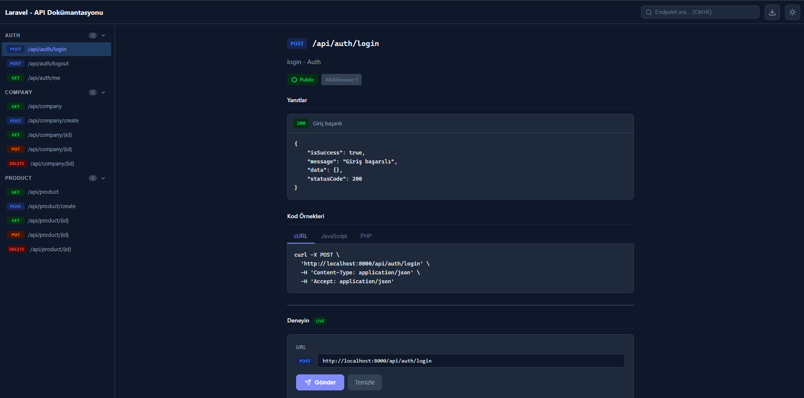
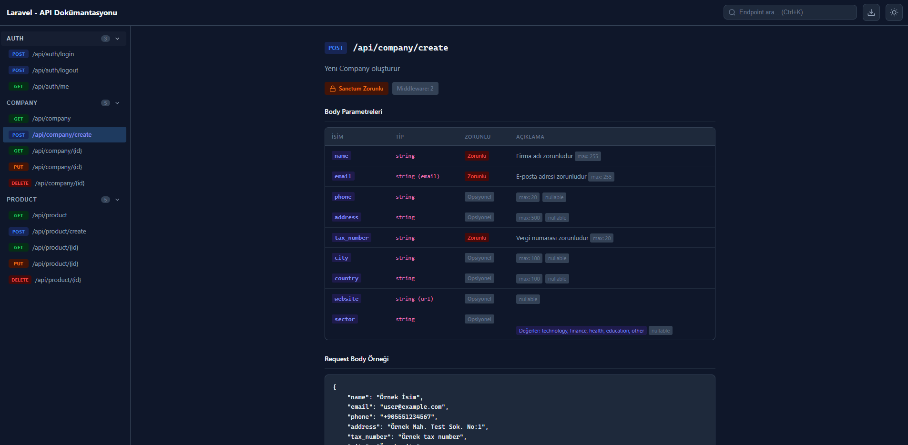
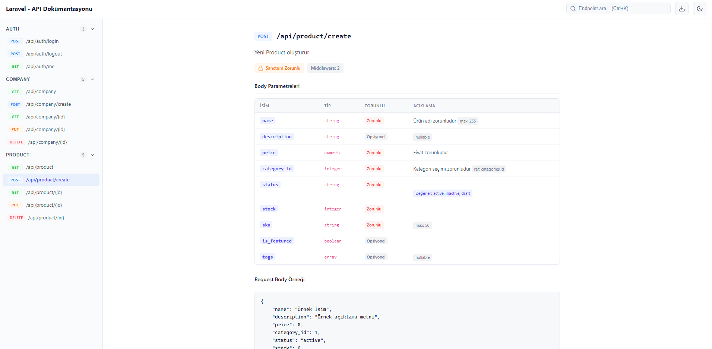
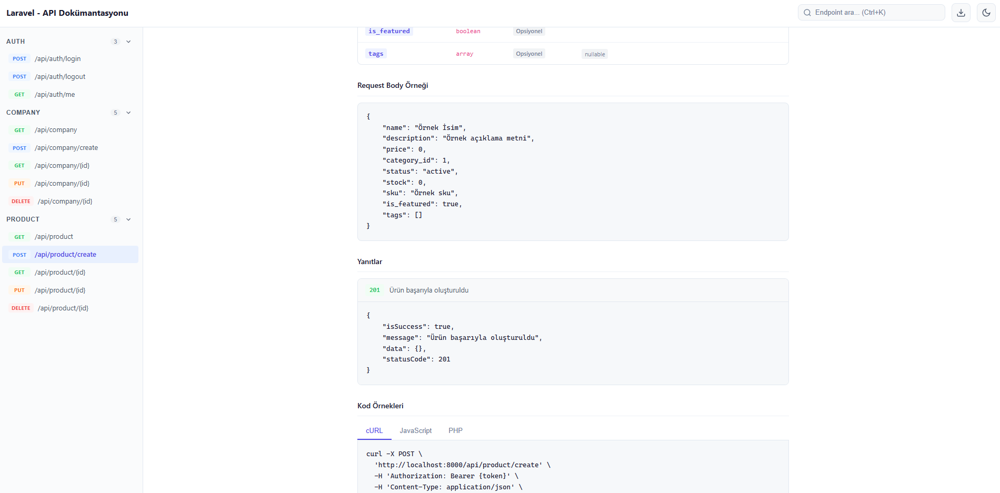

# Laravel API Docs Generator

[](https://github.com/emreyilmaz99/laravel-api-docs/releases)
[](LICENSE)
[](https://php.net)
[](https://laravel.com)

Laravel route, controller, FormRequest ve middleware'lerini otomatik parse ederek **interaktif API dokümantasyonu** oluşturan Composer paketi. Sıfır konfigürasyon ile çalışır — kurulumu yapın, tarayıcıda açın.

<p align="center">
  
</p>

---

## Özellikler

| Özellik | Açıklama |
|---------|----------|
| **Otomatik Endpoint Keşfi** | Route'lardan tüm API endpoint'lerini otomatik tarar |
| **FormRequest Analizi** | Validation kurallarından parametre tipi, zorunluluk, min/max, enum değerleri çıkarır |
| **Middleware Tespiti** | Auth tipi (Sanctum, Passport, vb.) ve permission bilgisini otomatik algılar |
| **Response Analizi** | Controller kaynak kodundan gerçek response mesajlarını ve status code'ları parse eder |
| **Try It (Live Test)** | Endpoint'leri doğrudan tarayıcıdan test edin |
| **Çoklu Export** | OpenAPI 3.0, Postman Collection v2.1, Markdown, JSON |
| **Dark / Light Tema** | Tek tıkla tema değiştirme |
| **Gelişmiş Arama** | Endpoint, parametre adı ve açıklamada arama (Ctrl+K) |
| **Cache Desteği** | Config ile TTL ayarı, artisan ile cache temizleme |
| **Çoklu Dil (i18n)** | Türkçe ve İngilizce, özelleştirilebilir çeviriler |
| **Mobil Uyumlu** | Responsive sidebar + hamburger menü |

---

## Ekran Görüntüleri

### Dark Tema — Endpoint Detay & Try It
<p align="center">
  
</p>

### Dark Tema — Body Parametreleri & Validation Kuralları
<p align="center">
  
</p>

### Light Tema — Parametre Tablosu
<p align="center">
  
</p>

### Light Tema — Request Body & Response Örnekleri
<p align="center">
  
</p>

---

---

## Hızlı Başlangıç

### Kurulum

```bash
composer require laravel-api-docs/generator
```

Laravel auto-discovery paketi otomatik kaydeder. Manuel kayıt gerekirse:

```php
// config/app.php
'providers' => [
    LaravelApiDocs\ApiDocsServiceProvider::class,
],
```

## Yapılandırma

Config dosyasını yayınlayın:

```bash
php artisan vendor:publish --tag=api-docs-config
```

`config/api-docs.php` dosyasında:

```php
return [
    'enabled' => env('API_DOCS_ENABLED', true),
    'path' => 'api-docs',
    'middleware' => ['web'],
    'route_prefix' => ['api'],
    'exclude_routes' => [],
    'exclude_middlewares' => [],
    'group_by' => 'prefix', // 'prefix' veya 'controller'
    'base_url' => env('API_DOCS_BASE_URL', 'http://localhost:8000'),
    'default_auth_header' => 'Authorization',
    'default_auth_prefix' => 'Bearer',
    'locale' => 'tr', // 'tr' veya 'en'
    'theme' => 'dark', // 'dark' veya 'light'
    'response_wrapper' => [
        'isSuccess' => 'boolean',
        'message' => 'string',
        'data' => 'mixed',
        'statusCode' => 'integer',
    ],
    'cache_ttl' => env('API_DOCS_CACHE_TTL', 0), // dakika, 0 = kapalı
];
```

## Kullanım

Tarayıcıda açın:

```
http://localhost:8000/api-docs
```

### Artisan Komutları

```bash
# Statik dosya olarak export
php artisan api-docs:generate
php artisan api-docs:generate --format=openapi
php artisan api-docs:generate --format=postman
php artisan api-docs:generate --format=markdown
php artisan api-docs:generate --format=json --output=docs/api.json

# Cache temizleme
php artisan api-docs:clear
```

### Export Endpoint'leri

| URL | Açıklama |
|-----|----------|
| `/api-docs` | İnteraktif HTML dokümantasyon |
| `/api-docs/json` | Ham JSON çıktısı |
| `/api-docs/openapi` | OpenAPI 3.0 spesifikasyonu |
| `/api-docs/postman` | Postman Collection v2.1 |
| `/api-docs/markdown` | Markdown dokümantasyon |

## View & Asset Yayınlama

```bash
# View'ları özelleştirmek için
php artisan vendor:publish --tag=api-docs-views

# Asset'leri public'e taşımak için
php artisan vendor:publish --tag=api-docs-assets
```

## Cache

Config'de `cache_ttl` değerini dakika cinsinden ayarlayıp cache'i aktif edin:

```php
'cache_ttl' => 60, // 60 dakika
```

Cache'i temizlemek için:

```bash
php artisan api-docs:clear
```

## Dil Desteği

Config'de `locale` değerini `tr` veya `en` olarak ayarlayın. Kendi çevirilerinizi eklemek için:

```bash
php artisan vendor:publish --tag=api-docs-lang
```

## Gereksinimler

- PHP >= 8.1
- Laravel 10, 11, 12 veya 13

## Katkıda Bulunma

Pull request'ler memnuniyetle karşılanır. Büyük değişiklikler için lütfen önce bir issue açın.

## Lisans

MIT — Detaylar için [LICENSE](LICENSE) dosyasına bakın.
